# Market App

A modern marketplace application built with React Native that connects buyers and sellers through an intuitive interface with real-time chat capabilities.

## About

This project began as part of a thesis project developed by **Abdul Doranai**. It was created to demonstrate modern mobile app development practices.

## Features

- **Post Management**: Create, edit, and manage marketplace listings
- **Real-time Chat**: Instant messaging between buyers and sellers
- **User Authentication**: Secure login and registration system
- **Push Notifications**: Stay updated on new messages and activities
- **GitHub Actions**: Automated workflows
- **Image Management**: Cloud-based image storage and optimization
- **User Blocking**: Control interactions with blocking system
- **Rate Limiting**: Prevent abuse with intelligent rate limiting
- **Bot Protection**: reCAPTCHA v2 integration for security
- **Modern UI with light and dark theme support**

## Screenshots

  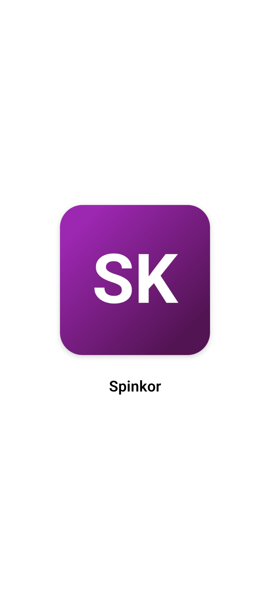
  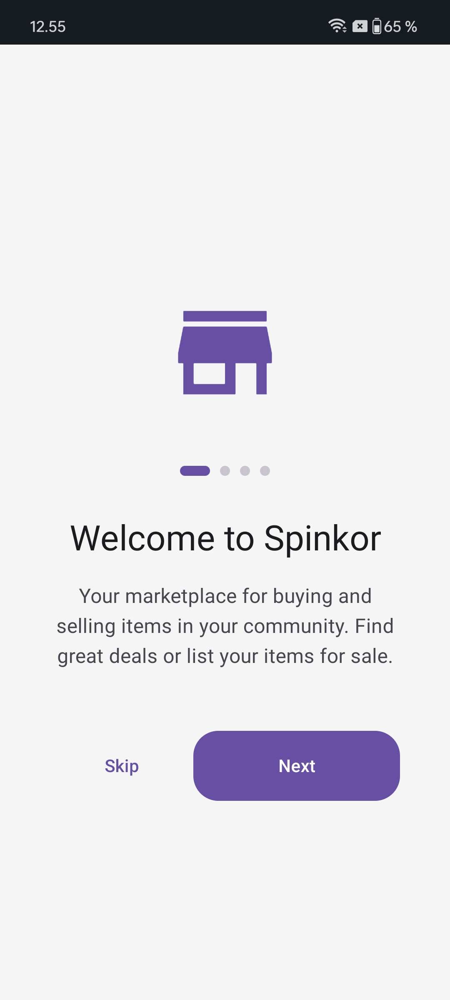
  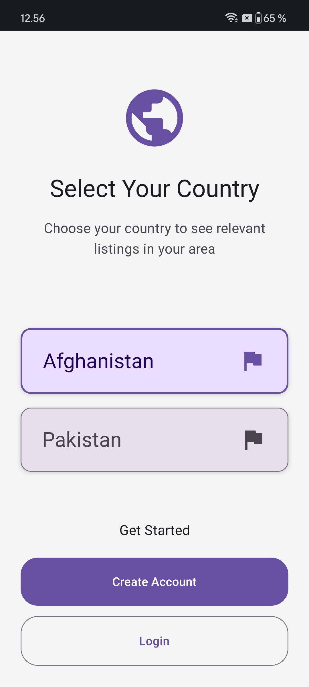
  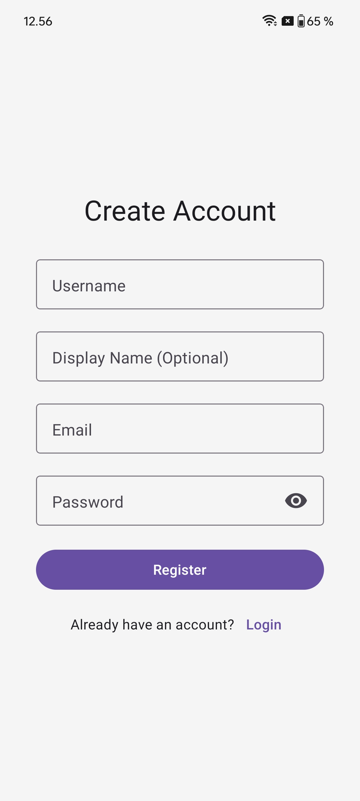
  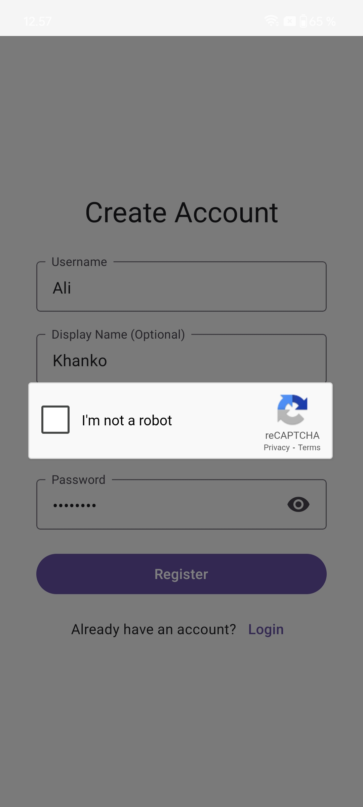
  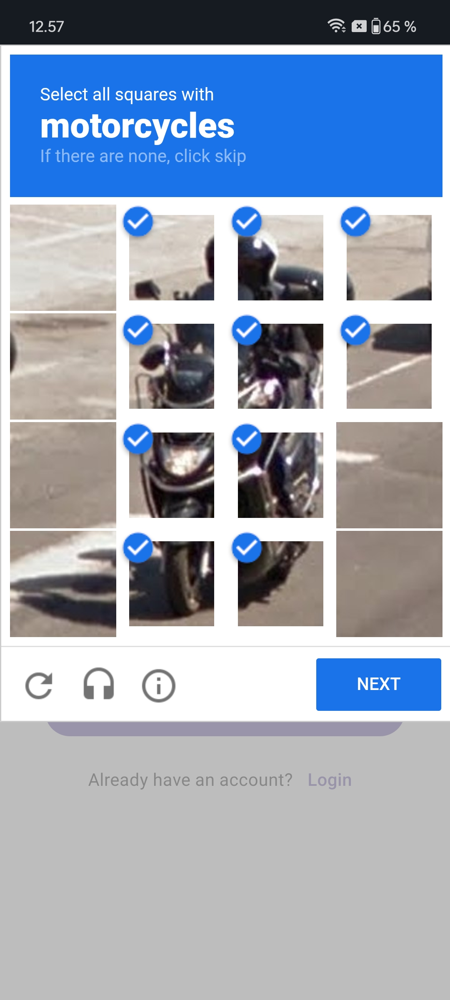

  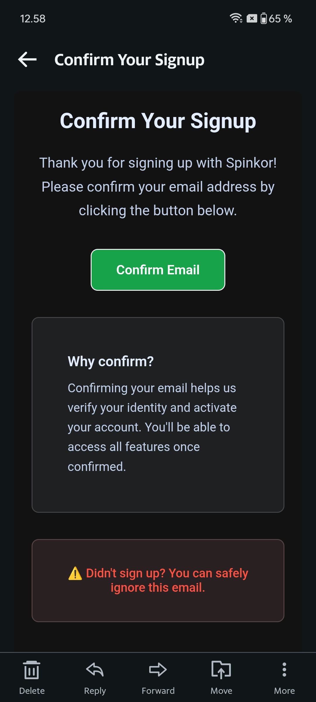
  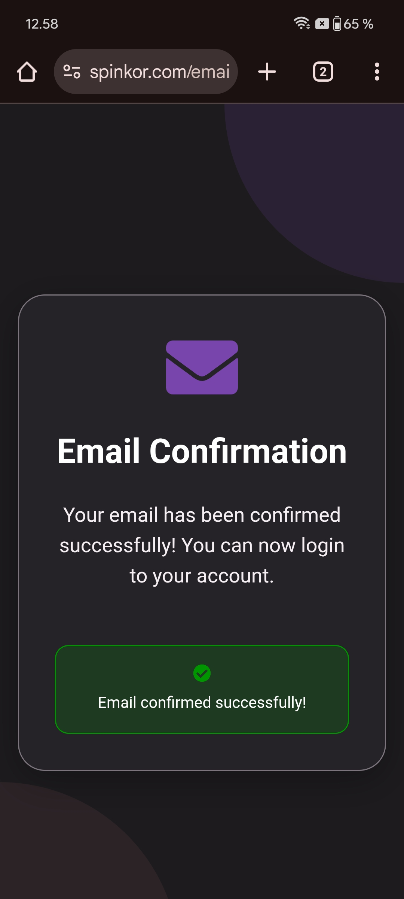
  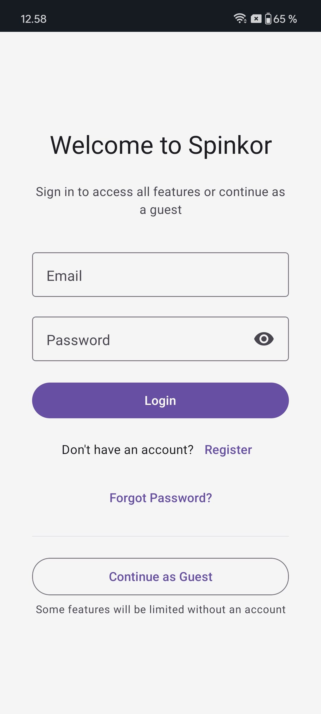
  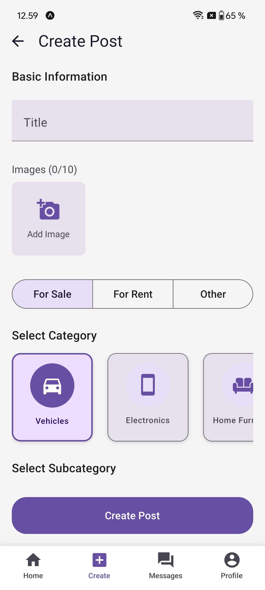
  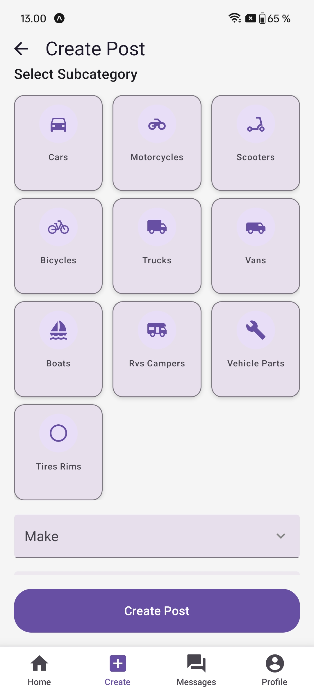
  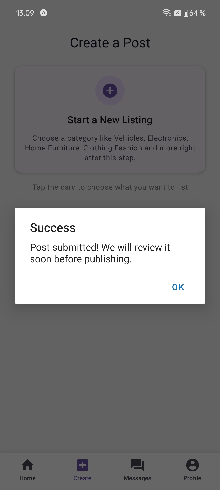

  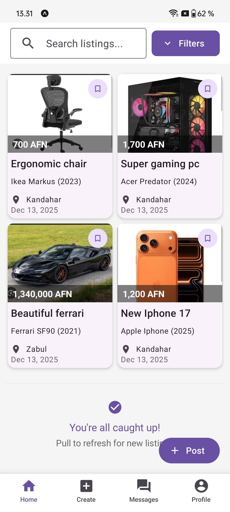
  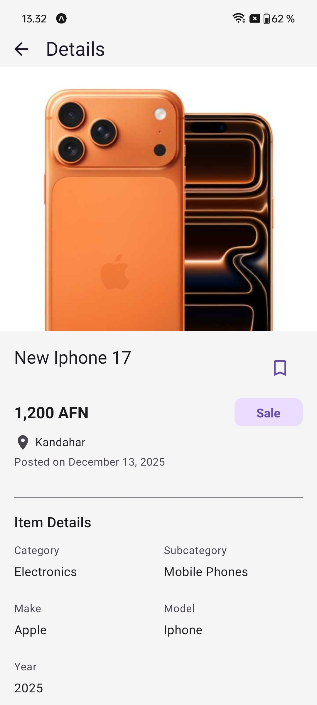
  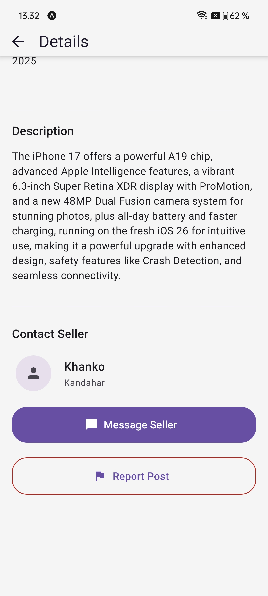
  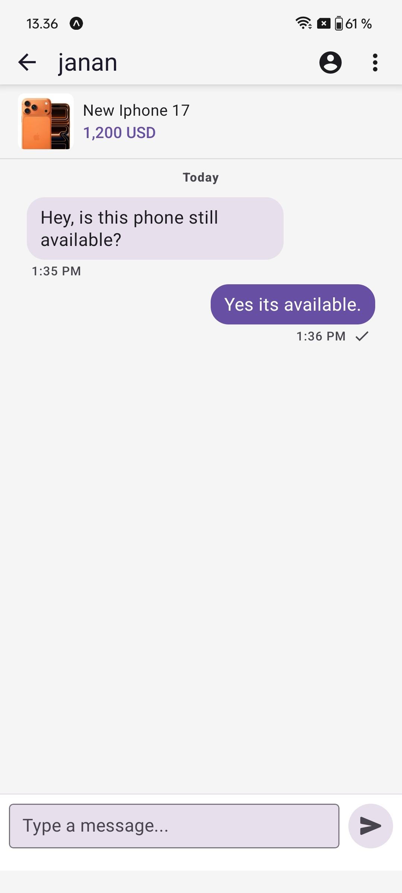
  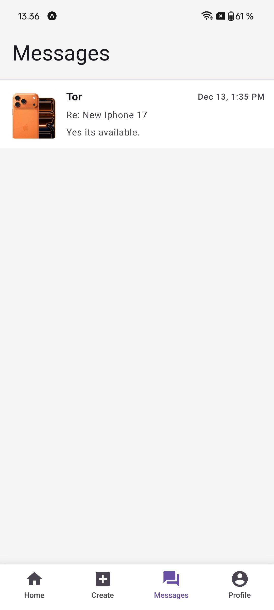
  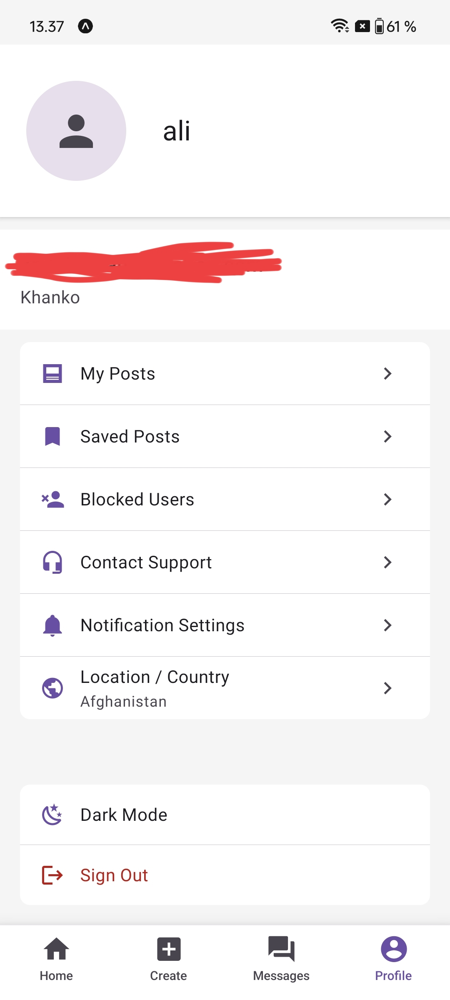

## Tech Stack

### Frontend
- **React Native**: Cross-platform mobile app development
- **React Native Paper**: Material Design components and theming
- **Expo**: Development platform and build tools

### Backend & Database
- **Supabase**: 
  - PostgreSQL database
  - Edge functions for serverless operations (password reset, user registration with reCAPTCHA and profile creation)
  - Real-time subscriptions for live updates
  - Row Level Security (RLS) for data protection

### Authentication & Security
- **Supabase Auth**: User authentication and session management
- **reCAPTCHA v2**: Bot prevention and abuse protection

### Storage & Media
- **Cloudinary**: Image upload, optimization, and CDN delivery

### Communication
- **SMTP**: Email delivery for account verification and password reset
- **Push Notifications**: Real-time mobile notifications with Expo notifications

### Performance
- **Upstash Redis**: Rate limiting

## Getting Started

1. Clone the repository
2. Install dependencies: `npm install`
3. Set up environment variables
4. Run the app: `npm start`

## Environment Variables

Required environment variables:
- `EXPO_PUBLIC_SUPABASE_URL`
- `EXPO_PUBLIC_SUPABASE_ANON_KEY`
- `CLOUDINARY_CLOUD_NAME`
- `CLOUDINARY_API_KEY`
- `CLOUDINARY_API_SECRET`
- `UPSTASH_REDIS_REST_URL`
- `UPSTASH_REDIS_REST_TOKEN`
- `EXPO_PUBLIC_RECAPTCHA_SITE_KEY`
- `EXPO_PUBLIC_RECAPTCHA_SECRET_KEY`

### Environment Setup

For the project to work fully, the following setup is required:

1. **Supabase Database**: 
   - Database schema, triggers, and functions need to be defined as intended
   - Run the SQL migrations from the `supabase/migrations/` folder

2. **GitHub Repository Secrets**: 
   - All environment variables must be configured in GitHub repository secrets
   - Required for GitHub Actions workflows to function correctly in production

3. **Expo Dashboard**: 
   - Environment variables need to be configured in the Expo project dashboard
   - Essential for production builds and deployments

## Architecture

The app follows a modern architecture with:
- **Component-based UI**: Reusable React Native components
- **State Management**: Zustand for global state
- **Custom Hooks**: Reusable business logic
- **Service Layer**: API and external service integration
- **Type Safety**: Full TypeScript implementation
- **Real-time Sync**: Live data updates across devices

